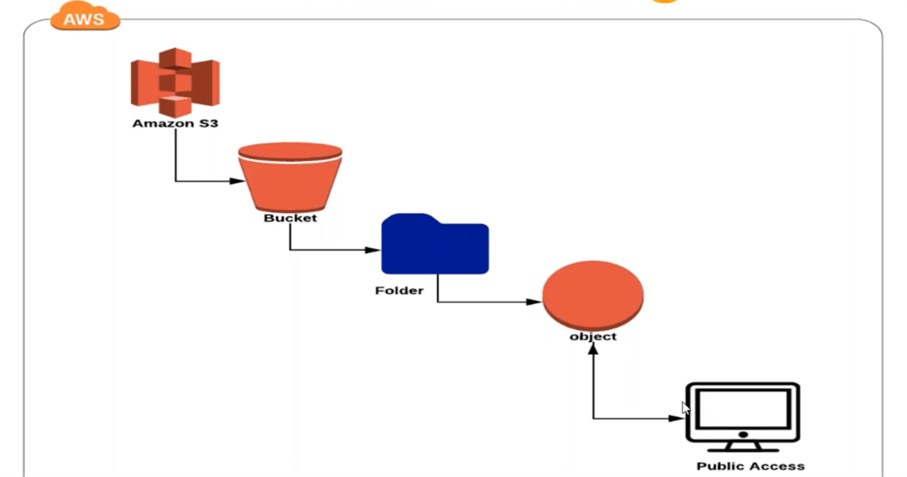

# 🌥 S3 Bucket

Simply, **S3(Simple Storage Service)** is a AWS tool which allows us to store our file, folder, photo, movie and so on  in locally and publicly. It helps us to protect any amount of data for a long period of time. We can access the date that are in s3 from any where in any time. &#x20;

<figure><figcaption></figcaption></figure>

**These are the step that need to do to create a AWS S3 bucket:**


```
Step 1: Search s3
Step 2: Click on create bucket
Step 3: It will ask for a Bucket name, Name should be globally unique and shouldn't contain any spaces or upper letter, This name will appear in website link
Step 4: Select the region which is near your location, if you select in different AZ, there will be delays in process of upload and download
Step 5: Select Object Ownership, ACLs(Access Control List) enable or disable
Step 6: Select if you want to block all public access or not
Step 7: Enable or Disable according to you for Bucket Versioning and defult encryption
Step 8: Click on Create bucket
```

<figure><figcaption></figcaption></figure>

I named **rajan04**, region **N.California**, with **no public** access.

If we click on name of bucket(rajan04) you can see a option of upload file, properties, permissions and all.

<figure><figcaption></figcaption></figure>

If you like to add photo from your local computer, just click on upload and add files or folders.&#x20;

&#x20;We can change the permissions to everyone(Public Access), anyone from internet can view our file or photo.&#x20;

<figure><figcaption></figcaption></figure>

Now we can able to view our date from internet. We can see the link if we see under properties:

<figure><figcaption></figcaption></figure>

<figure><figcaption></figcaption></figure>
